# درختچهٔ کامل کیوپدیا — دسته → زیردسته → مقاله

**منبع:** اکسپورت زندهٔ وردپرس، ۱۱ سپتامبر ۲۰۲۶
**مقالات منتشرشده:** 156  ·  **پیش‌نویس:** 19  ·  **دانشمندان منتشرشده:** 58

هر مقاله به **برگ** (زیردسته اگر باشد، وگرنه دستهٔ اصلی) وصل شده است.

---

## نمودار ساختار دسته‌ها

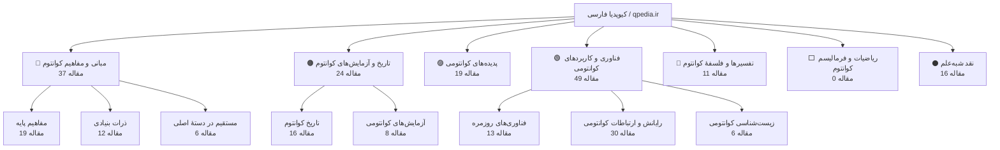

---

## آمار دسته و زیردسته (منتشرشده)

| دسته | اسلاگ | زیردسته | اسلاگ زیردسته | تعداد مقاله |
|---|---|---|---|---:|
| 🔵 مبانی و مفاهیم کوانتوم | `fundamentals` | مفاهیم پایه | `core-concepts` | 19 |
|  |  | ذرات بنیادی | `particles` | 12 |
|  |  | *(بدون زیردسته — سطح دستهٔ اصلی)* | `fundamentals` | 6 |
| 🟠 تاریخ و آزمایش‌های کوانتوم | `history-experiments` | تاریخ کوانتوم | `history` | 16 |
|  |  | آزمایش‌های کوانتومی | `experiments` | 8 |
| 🟣 پدیده‌های کوانتومی | `phenomena` | — | — | 19 |
| 🟢 فناوری و کاربردهای کوانتومی | `technology` | فناوری‌های روزمره | `everyday-tech` | 13 |
|  |  | رایانش و ارتباطات کوانتومی | `quantum-computing` | 30 |
|  |  | زیست‌شناسی کوانتومی | `quantum-biology` | 6 |
| 🔴 تفسیرها و فلسفهٔ کوانتوم | `interpretations` | — | — | 11 |
| ⬜ ریاضیات و فرمالیسم کوانتوم | `mathematics` | — | — | 0 |
| ⚫ نقد شبه‌علم | `pseudoscience` | — | — | 16 |
| **جمع** |  |  |  | **156** |

---

## درختچهٔ کامل (دسته → زیردسته → مقالات متصل)

### 🔵 مبانی و مفاهیم کوانتوم (`fundamentals`) — 37 مقالهٔ منتشرشده

#### زیردسته: مفاهیم پایه (`core-concepts`) — 19

```
مبانی و مفاهیم کوانتوم
 └─ مفاهیم پایه
    ├─ اسپین؛ چرخشی که چرخش نیست  →  quantum-spin
    ├─ اصل طرد پاولی دقیقاً چه می‌گوید؟ به زبان ساده  →  pauli-exclusion-principle
    ├─ اصل عدم قطعیت هایزنبرگ به زبان ساده  →  heisenberg-uncertainty-principle
    ├─ اندازه‌گیری و فروپاشی  →  quantum-measurement
    ├─ برهم نهی چیست؟ وقتی یک ذره «هم این است هم آن»  →  superposition-explained
    ├─ برهم‌نهی کوانتومی  →  quantum-superposition
    ├─ بهترین مستندهای فیزیک کوانتوم که باید ببینید  →  quantum-documentaries
    ├─ تابع موج چیست؟  →  wave-function
    ├─ ترازهای انرژی و کوانتش  →  energy-levels
    ├─ تفاوت فیزیک کوانتوم و مکانیک کوانتومی چیست؟  →  quantum-physics-vs-quantum-mechanics
    ├─ ثابت پلانک؛ کوچک‌ترین واحد جهان  →  planck-constant
    ├─ دوگانگی موج و ذره  →  wave-particle-duality
    ├─ منابع معتبر فارسی و انگلیسی برای یادگیری عمیق‌تر کوانتوم  →  quantum-learning-resources
    ├─ نقشهٔ ذهنی پنج‌گانه برای فهم درست کوانتوم  →  quantum-fivefold-mental-map
    ├─ واهمدوسی؛ چرا دنیا عادی است!  →  decoherence
    ├─ چرا تله پورت انسان از نظر علمی غیرممکن است؟  →  human-teleportation
    ├─ چرا ریاضیات کوانتوم درست است ولی فهمش سخت است؟  →  why-quantum-math-works
    ├─ چرا کوانتوم را در زندگی روزمره حس نمی کنیم؟  →  quantum-classical-boundary
    └─ کوانتوم یعنی چه؟  →  what-is-quantum
```

- اسپین؛ چرخشی که چرخش نیست — `quantum-spin`
- اصل طرد پاولی دقیقاً چه می‌گوید؟ به زبان ساده — `pauli-exclusion-principle`
- اصل عدم قطعیت هایزنبرگ به زبان ساده — `heisenberg-uncertainty-principle`
- اندازه‌گیری و فروپاشی — `quantum-measurement`
- برهم نهی چیست؟ وقتی یک ذره «هم این است هم آن» — `superposition-explained`
- برهم‌نهی کوانتومی — `quantum-superposition`
- بهترین مستندهای فیزیک کوانتوم که باید ببینید — `quantum-documentaries`
- تابع موج چیست؟ — `wave-function`
- ترازهای انرژی و کوانتش — `energy-levels`
- تفاوت فیزیک کوانتوم و مکانیک کوانتومی چیست؟ — `quantum-physics-vs-quantum-mechanics`
- ثابت پلانک؛ کوچک‌ترین واحد جهان — `planck-constant`
- دوگانگی موج و ذره — `wave-particle-duality`
- منابع معتبر فارسی و انگلیسی برای یادگیری عمیق‌تر کوانتوم — `quantum-learning-resources`
- نقشهٔ ذهنی پنج‌گانه برای فهم درست کوانتوم — `quantum-fivefold-mental-map`
- واهمدوسی؛ چرا دنیا عادی است! — `decoherence`
- چرا تله پورت انسان از نظر علمی غیرممکن است؟ — `human-teleportation`
- چرا ریاضیات کوانتوم درست است ولی فهمش سخت است؟ — `why-quantum-math-works`
- چرا کوانتوم را در زندگی روزمره حس نمی کنیم؟ — `quantum-classical-boundary`
- کوانتوم یعنی چه؟ — `what-is-quantum`

<details>
<summary>نمودار mermaid — مفاهیم پایه</summary>

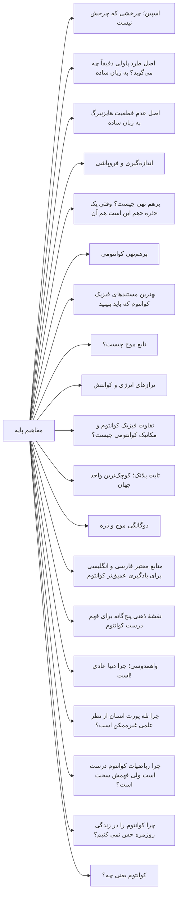

</details>

#### زیردسته: ذرات بنیادی (`particles`) — 12

```
مبانی و مفاهیم کوانتوم
 └─ ذرات بنیادی
    ├─ اسپین هسته‌ای چیست؟  →  nuclear-spin
    ├─ الکترون چیست؟ ویژگی‌ها، نقش در اتم و برق  →  electron
    ├─ بوزون هیگز چیست؟  →  higgs-boson
    ├─ ذرات مجازی چیستند؟  →  virtual-particles
    ├─ فوتون دقیقا چیست ؟  →  photon
    ├─ مدل استاندارد چیست؟  →  standard-model
    ├─ میون و تاو؛ پسرعموهای سنگین الکترون  →  muon-and-tau
    ├─ نوترینو چیست؟  →  neutrino
    ├─ پادماده چیست؟  →  antimatter
    ├─ پروتون از چه ساخته شده؟ کوارک کافی نیست  →  proton-neutron-quark-structure
    ├─ کوارک چیست؟  →  quark
    └─ گلوئون و بوزون W و Z؛ چسب هسته و واپاشی  →  gluon-w-z-bosons
```

- اسپین هسته‌ای چیست؟ — `nuclear-spin`
- الکترون چیست؟ ویژگی‌ها، نقش در اتم و برق — `electron`
- بوزون هیگز چیست؟ — `higgs-boson`
- ذرات مجازی چیستند؟ — `virtual-particles`
- فوتون دقیقا چیست ؟ — `photon`
- مدل استاندارد چیست؟ — `standard-model`
- میون و تاو؛ پسرعموهای سنگین الکترون — `muon-and-tau`
- نوترینو چیست؟ — `neutrino`
- پادماده چیست؟ — `antimatter`
- پروتون از چه ساخته شده؟ کوارک کافی نیست — `proton-neutron-quark-structure`
- کوارک چیست؟ — `quark`
- گلوئون و بوزون W و Z؛ چسب هسته و واپاشی — `gluon-w-z-bosons`

<details>
<summary>نمودار mermaid — ذرات بنیادی</summary>

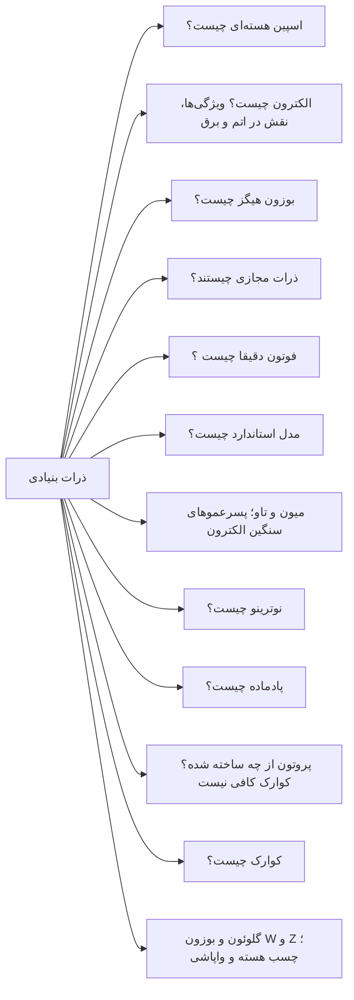

</details>

#### بدون زیردسته — سطح دستهٔ اصلی (`fundamentals`) — 6

```
مبانی و مفاهیم کوانتوم
 └─ (مستقیم)
    ├─ آیا فیزیک کلاسیک اشتباه بود؟ نه، محدود بود  →  is-classical-physics-wrong
    ├─ برهم نهی یعنی چه، و چرا اشیای بزرگ برهم نهی نمی شوند  →  why-large-objects-dont-superpose
    ├─ تفاوت جبرگرایی کلاسیک و احتمال کوانتومی  →  determinism-vs-probability
    ├─ تمثیل تاس در مقابل تمثیل سکه: کدام برای عدم قطعیت بهتر است؟  →  coin-vs-dice-quantum-uncertainty
    ├─ تمرین ذهنی: خودتان یک تمثیل بسازید و مرزش را پیدا کنید  →  quantum-analogy-exercise-boundary
    └─ چرا «نفهمیدنِ درست» کوانتوم، خودش یک دستاورد است؟  →  quantum-understanding-achievement
```

- آیا فیزیک کلاسیک اشتباه بود؟ نه، محدود بود — `is-classical-physics-wrong`
- برهم نهی یعنی چه، و چرا اشیای بزرگ برهم نهی نمی شوند — `why-large-objects-dont-superpose`
- تفاوت جبرگرایی کلاسیک و احتمال کوانتومی — `determinism-vs-probability`
- تمثیل تاس در مقابل تمثیل سکه: کدام برای عدم قطعیت بهتر است؟ — `coin-vs-dice-quantum-uncertainty`
- تمرین ذهنی: خودتان یک تمثیل بسازید و مرزش را پیدا کنید — `quantum-analogy-exercise-boundary`
- چرا «نفهمیدنِ درست» کوانتوم، خودش یک دستاورد است؟ — `quantum-understanding-achievement`

### 🟠 تاریخ و آزمایش‌های کوانتوم (`history-experiments`) — 24 مقالهٔ منتشرشده

#### زیردسته: تاریخ کوانتوم (`history`) — 16

```
تاریخ و آزمایش‌های کوانتوم
 └─ تاریخ کوانتوم
    ├─ اثر فوتوالکتریک  →  photoelectric-effect
    ├─ اینشتین و اثر فوتوالکتریک (نه فقط نسبیت)  →  einstein-photoelectric-effect
    ├─ ده دیدگاه فیزیکدانان بزرگ دربارهٔ عجایب کوانتوم  →  physicists-on-quantum-weirdness
    ├─ دیراک و پیش‌بینی پادماده؛ وقتی ریاضیات از واقعیت جلو زد  →  dirac-antimatter
    ├─ زنان فراموش‌شدهٔ فیزیک کوانتوم  →  forgotten-women-quantum
    ├─ شرودینگر: زندگی، معادله و گربه‌ای که هرگز نداشت  →  schrodinger-life-equation
    ├─ صد سالگی کوانتوم؛ از جزیرهٔ هلگولاند تا امروز  →  quantum-century-2025
    ├─ فاجعهٔ فرابنفش  →  ultraviolet-catastrophe
    ├─ فاینمن: نابغه‌ای که کوانتوم را ساده توضیح می‌داد  →  feynman-quantum-explainer
    ├─ مدل اتمی بور  →  bohr-atomic-model
    ├─ نامساوی بل  →  bell-inequality
    ├─ نبرد اینشتین و بور بر سر معنای کوانتوم  →  einstein-bohr-debate
    ├─ نوبل فیزیک ۲۰۲۵؛ وقتی یک مدار مثل اتم رفتار کرد  →  nobel-physics-2025
    ├─ پارادوکس EPR؛ اعتراض اینشتین که فیزیک را جلو برد  →  epr-paradox
    ├─ پلانک و بحران تابش جسم سیاه؛ جرقه‌ای که فیزیک را متحول کرد  →  max-planck-blackbody
    └─ کنفرانس سولوی ۱۹۲۷ چه بود؟  →  solvay-conference-1927
```

- اثر فوتوالکتریک — `photoelectric-effect`
- اینشتین و اثر فوتوالکتریک (نه فقط نسبیت) — `einstein-photoelectric-effect`
- ده دیدگاه فیزیکدانان بزرگ دربارهٔ عجایب کوانتوم — `physicists-on-quantum-weirdness`
- دیراک و پیش‌بینی پادماده؛ وقتی ریاضیات از واقعیت جلو زد — `dirac-antimatter`
- زنان فراموش‌شدهٔ فیزیک کوانتوم — `forgotten-women-quantum`
- شرودینگر: زندگی، معادله و گربه‌ای که هرگز نداشت — `schrodinger-life-equation`
- صد سالگی کوانتوم؛ از جزیرهٔ هلگولاند تا امروز — `quantum-century-2025`
- فاجعهٔ فرابنفش — `ultraviolet-catastrophe`
- فاینمن: نابغه‌ای که کوانتوم را ساده توضیح می‌داد — `feynman-quantum-explainer`
- مدل اتمی بور — `bohr-atomic-model`
- نامساوی بل — `bell-inequality`
- نبرد اینشتین و بور بر سر معنای کوانتوم — `einstein-bohr-debate`
- نوبل فیزیک ۲۰۲۵؛ وقتی یک مدار مثل اتم رفتار کرد — `nobel-physics-2025`
- پارادوکس EPR؛ اعتراض اینشتین که فیزیک را جلو برد — `epr-paradox`
- پلانک و بحران تابش جسم سیاه؛ جرقه‌ای که فیزیک را متحول کرد — `max-planck-blackbody`
- کنفرانس سولوی ۱۹۲۷ چه بود؟ — `solvay-conference-1927`

<details>
<summary>نمودار mermaid — تاریخ کوانتوم</summary>

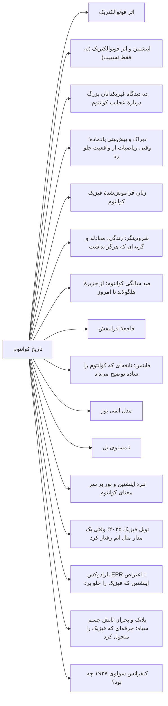

</details>

#### زیردسته: آزمایش‌های کوانتومی (`experiments`) — 8

```
تاریخ و آزمایش‌های کوانتوم
 └─ آزمایش‌های کوانتومی
    ├─ آزمایش آسپه ۱۹۸۲ چه بود؟  →  aspect-experiment-1982
    ├─ آزمایش اشترن-گرلاخ چیست؟  →  stern-gerlach-experiment
    ├─ آزمایش دو شکاف  →  double-slit-experiment
    ├─ آزمایش های بل: چگونه درهم تنیدگی اثبات شد!  →  bell-experiments
    ├─ اثر زنون کوانتومی  →  quantum-zeno-effect
    ├─ نوبل فیزیک ۲۰۲۳؛ عکاسی از حرکت الکترون  →  attosecond-nobel-2023
    ├─ پاک کن کوانتومی؛ آیا آینده بر گذشته اثر می گذارد؟  →  quantum-eraser
    └─ چگالش بوز-اینشتین چیست؟  →  bose-einstein-condensate
```

- آزمایش آسپه ۱۹۸۲ چه بود؟ — `aspect-experiment-1982`
- آزمایش اشترن-گرلاخ چیست؟ — `stern-gerlach-experiment`
- آزمایش دو شکاف — `double-slit-experiment`
- آزمایش های بل: چگونه درهم تنیدگی اثبات شد! — `bell-experiments`
- اثر زنون کوانتومی — `quantum-zeno-effect`
- نوبل فیزیک ۲۰۲۳؛ عکاسی از حرکت الکترون — `attosecond-nobel-2023`
- پاک کن کوانتومی؛ آیا آینده بر گذشته اثر می گذارد؟ — `quantum-eraser`
- چگالش بوز-اینشتین چیست؟ — `bose-einstein-condensate`

<details>
<summary>نمودار mermaid — آزمایش‌های کوانتومی</summary>

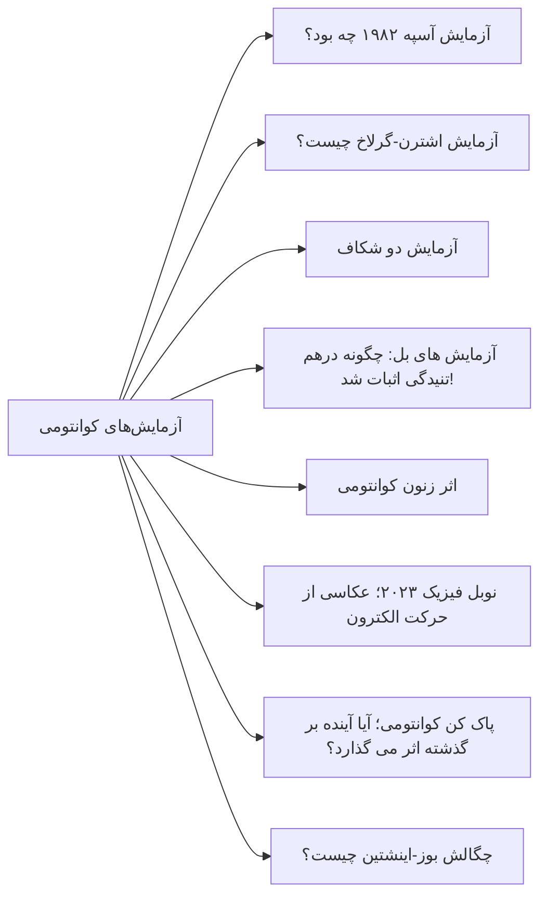

</details>

### 🟣 پدیده‌های کوانتومی (`phenomena`) — 19 مقالهٔ منتشرشده

```
پدیده‌های کوانتومی
 ├─ آیا سفر در زمان با فیزیک کوانتوم ممکن است؟  →  quantum-time-travel
 ├─ ابررسانایی  →  superconductivity
 ├─ ابرشارگی؛ مایعی که از لیوان بالا می‌رود  →  superfluidity
 ├─ اثر کازیمیر  →  casimir-effect
 ├─ افت وخیز کوانتومی؛ چطور کهکشان ها متولد شدند؟  →  quantum-fluctuations-cosmos
 ├─ ترمودینامیک کوانتومی؛ موتوری به اندازهٔ یک اتم  →  quantum-thermodynamics
 ├─ تله پورت پیوسته؛ موج نور نه فقط کیوبیت  →  continuous-variable-teleportation
 ├─ تونل‌زنی کوانتومی  →  quantum-tunneling
 ├─ درهم‌تنیدگی کوانتومی  →  quantum-entanglement-explained
 ├─ صفر مطلق چیست؟  →  absolute-zero
 ├─ مایع اسپینی کوانتومی؛ ماده ای که هرگز آرام نمی گیرد  →  quantum-spin-liquid
 ├─ نوسانات خلأ  →  vacuum-fluctuations
 ├─ همجوشی ستارگان چگونه ممکن است؟  →  stellar-fusion
 ├─ همدوسی چیست؟  →  coherence
 ├─ واپاشی آلفا چیست؟  →  alpha-decay
 ├─ پارادوکس اطلاعات سیاه چاله؛ معمای هاوکینگ  →  black-hole-information-paradox
 ├─ کریستال زمان چیست؟ ماده ای که در زمان تکرار می شود  →  time-crystal
 ├─ گربهٔ شرودینگر  →  schrodinger-cat
 └─ گسیل تحریکی چیست؟  →  stimulated-emission
```

- آیا سفر در زمان با فیزیک کوانتوم ممکن است؟ — `quantum-time-travel`
- ابررسانایی — `superconductivity`
- ابرشارگی؛ مایعی که از لیوان بالا می‌رود — `superfluidity`
- اثر کازیمیر — `casimir-effect`
- افت وخیز کوانتومی؛ چطور کهکشان ها متولد شدند؟ — `quantum-fluctuations-cosmos`
- ترمودینامیک کوانتومی؛ موتوری به اندازهٔ یک اتم — `quantum-thermodynamics`
- تله پورت پیوسته؛ موج نور نه فقط کیوبیت — `continuous-variable-teleportation`
- تونل‌زنی کوانتومی — `quantum-tunneling`
- درهم‌تنیدگی کوانتومی — `quantum-entanglement-explained`
- صفر مطلق چیست؟ — `absolute-zero`
- مایع اسپینی کوانتومی؛ ماده ای که هرگز آرام نمی گیرد — `quantum-spin-liquid`
- نوسانات خلأ — `vacuum-fluctuations`
- همجوشی ستارگان چگونه ممکن است؟ — `stellar-fusion`
- همدوسی چیست؟ — `coherence`
- واپاشی آلفا چیست؟ — `alpha-decay`
- پارادوکس اطلاعات سیاه چاله؛ معمای هاوکینگ — `black-hole-information-paradox`
- کریستال زمان چیست؟ ماده ای که در زمان تکرار می شود — `time-crystal`
- گربهٔ شرودینگر — `schrodinger-cat`
- گسیل تحریکی چیست؟ — `stimulated-emission`

<details>
<summary>نمودار mermaid — پدیده‌های کوانتومی</summary>

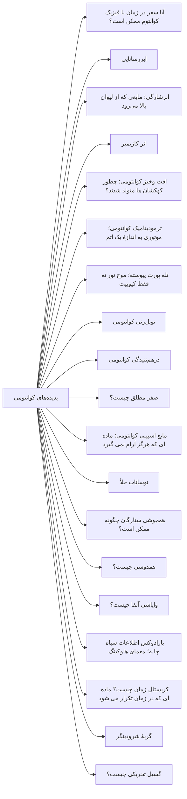

</details>

### 🟢 فناوری و کاربردهای کوانتومی (`technology`) — 49 مقالهٔ منتشرشده

#### زیردسته: فناوری‌های روزمره (`everyday-tech`) — 13

```
فناوری و کاربردهای کوانتومی
 └─ فناوری‌های روزمره
    ├─ ام‌آرآی (MRI) چگونه کار می‌کند؟ ریشهٔ کوانتومی آن  →  mri-quantum
    ├─ باتری کوانتومی؛ چرا بزرگ تر یعنی سریع تر؟  →  quantum-battery
    ├─ ترانزیستور؛ کوانتوم در جیب شما  →  transistor-quantum
    ├─ حافظهٔ فلش چطور کار می‌کند؟  →  flash-memory
    ├─ ساعت اتمی و جی‌پی‌اس  →  atomic-clock-gps
    ├─ شیمی کوانتومی چیست؟ چرا دستتان از دیوار رد نمی شود  →  quantum-chemistry
    ├─ فیبر نوری چگونه کار می‌کند؟  →  fiber-optics
    ├─ لیزر چطور کار می‌کند؟  →  how-lasers-work
    ├─ میکروسکوپ تونلی چیست؟  →  scanning-tunneling-microscope
    ├─ نقطهٔ کوانتومی؛ کوانتومی که در تلویزیون شماست  →  quantum-dots-displays
    ├─ پادماده در پزشکی؛ اسکن پت چطور کار می کند؟  →  pet-scan-antimatter
    ├─ پایان قانون مور؛ چرا ترانزیستورها به دیوار خوردند؟  →  moore-law-quantum-limit
    └─ پنل خورشیدی و اثر فوتوالکتریک؛ تبدیل نور به جریان زندگی  →  solar-cells-photoelectric
```

- ام‌آرآی (MRI) چگونه کار می‌کند؟ ریشهٔ کوانتومی آن — `mri-quantum`
- باتری کوانتومی؛ چرا بزرگ تر یعنی سریع تر؟ — `quantum-battery`
- ترانزیستور؛ کوانتوم در جیب شما — `transistor-quantum`
- حافظهٔ فلش چطور کار می‌کند؟ — `flash-memory`
- ساعت اتمی و جی‌پی‌اس — `atomic-clock-gps`
- شیمی کوانتومی چیست؟ چرا دستتان از دیوار رد نمی شود — `quantum-chemistry`
- فیبر نوری چگونه کار می‌کند؟ — `fiber-optics`
- لیزر چطور کار می‌کند؟ — `how-lasers-work`
- میکروسکوپ تونلی چیست؟ — `scanning-tunneling-microscope`
- نقطهٔ کوانتومی؛ کوانتومی که در تلویزیون شماست — `quantum-dots-displays`
- پادماده در پزشکی؛ اسکن پت چطور کار می کند؟ — `pet-scan-antimatter`
- پایان قانون مور؛ چرا ترانزیستورها به دیوار خوردند؟ — `moore-law-quantum-limit`
- پنل خورشیدی و اثر فوتوالکتریک؛ تبدیل نور به جریان زندگی — `solar-cells-photoelectric`

<details>
<summary>نمودار mermaid — فناوری‌های روزمره</summary>

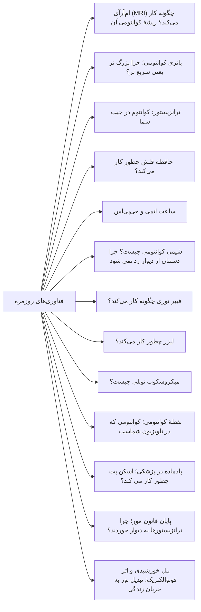

</details>

#### زیردسته: رایانش و ارتباطات کوانتومی (`quantum-computing`) — 30

```
فناوری و کاربردهای کوانتومی
 └─ رایانش و ارتباطات کوانتومی
    ├─ آنیلینگ کوانتومی؛ چرا هزار کیوبیت یعنی هزار کیوبیت نیست  →  quantum-annealing-dwave
    ├─ آیا هوش مصنوعی از کوانتوم استفاده می کند؟  →  does-ai-use-quantum
    ├─ آیا کامپیوتر کوانتومی بیت کوین را نابود می کند؟  →  bitcoin-quantum-threat
    ├─ آینده شغلی: آیا باید فیزیک کوانتوم یاد بگیریم؟  →  quantum-career-future-learn
    ├─ الان جمع کن، بعداً رمزگشایی کن؛ تهدیدی که فعال است  →  harvest-now-decrypt-later
    ├─ الگوریتم شور چیست؟  →  shor-algorithm
    ├─ الگوریتم گروور چیست؟  →  grover-algorithm
    ├─ اینترنت کوانتومی فضایی؛ ماجرای ماهوارهٔ میسیوس  →  quantum-internet-satellite
    ├─ برتری کوانتومی چیست؟  →  quantum-supremacy
    ├─ تراشهٔ ویلو؛ گوگل واقعاً چه چیزی را ثابت کرد؟  →  willow-chip
    ├─ تصحیح خطای کوانتومی چیست؟  →  quantum-error-correction
    ├─ تصحیح خطای کوانتومی؛ نقطهٔ عطف گوگل در نیچر  →  google-error-correction
    ├─ تله پورت کوانتومی چیست؟  →  quantum-teleportation
    ├─ حسگرهای کوانتومی؛ آیندهٔ دقت اندازه‌گیری  →  quantum-sensors
    ├─ درهم‌تنیدگی در کامپیوترهای کوانتومی امروزی  →  entanglement-quantum-computers
    ├─ رادار کوانتومی؛ آیا جنگندهٔ رادارگریز را می بیند؟  →  quantum-radar
    ├─ رمزنگاری پساکوانتومی؛ قفل های تازهٔ اینترنت  →  post-quantum-cryptography
    ├─ رمزنگاری کوانتومی و آیندهٔ امنیت اینترنت  →  quantum-cryptography-internet-security
    ├─ روز کیو چیست و واقعاً کِی می رسد؟  →  q-day
    ├─ شبیه‌سازی کوانتومی چیست؟  →  quantum-simulation
    ├─ عدد تصادفی کوانتومی؛ تنها تصادف واقعی جهان  →  quantum-random-number-generator
    ├─ قضیهٔ عدم کپی؛ چرا کوانتوم را نمی توان تکثیر کرد؟  →  no-cloning-theorem
    ├─ ناوبری کوانتومی؛ مسیریابی بدون ماهواره  →  quantum-navigation
    ├─ پردازندهٔ IBM Condor؛ چرا هزار کیوبیت کافی نیست  →  ibm-condor-processor
    ├─ پیوند جوزفسون؛ قلب تپندهٔ کامپیوتر کوانتومی  →  josephson-junction
    ├─ کامپیوتر توپولوژیک؛ گره ای که خطا را نمی بیند  →  topological-quantum-computing
    ├─ کامپیوتر کوانتومی چیست و چقدر با واقعیت فاصله دارد؟  →  quantum-computer-reality
    ├─ کیوبیت چیست؟  →  qubit
    ├─ گیت کوانتومی؛ آجرهای سازندهٔ کامپیوتر کوانتومی  →  quantum-gate
    └─ یادگیری ماشین کوانتومی؛ وعده ها و واقعیت ها  →  quantum-machine-learning
```

- آنیلینگ کوانتومی؛ چرا هزار کیوبیت یعنی هزار کیوبیت نیست — `quantum-annealing-dwave`
- آیا هوش مصنوعی از کوانتوم استفاده می کند؟ — `does-ai-use-quantum`
- آیا کامپیوتر کوانتومی بیت کوین را نابود می کند؟ — `bitcoin-quantum-threat`
- آینده شغلی: آیا باید فیزیک کوانتوم یاد بگیریم؟ — `quantum-career-future-learn`
- الان جمع کن، بعداً رمزگشایی کن؛ تهدیدی که فعال است — `harvest-now-decrypt-later`
- الگوریتم شور چیست؟ — `shor-algorithm`
- الگوریتم گروور چیست؟ — `grover-algorithm`
- اینترنت کوانتومی فضایی؛ ماجرای ماهوارهٔ میسیوس — `quantum-internet-satellite`
- برتری کوانتومی چیست؟ — `quantum-supremacy`
- تراشهٔ ویلو؛ گوگل واقعاً چه چیزی را ثابت کرد؟ — `willow-chip`
- تصحیح خطای کوانتومی چیست؟ — `quantum-error-correction`
- تصحیح خطای کوانتومی؛ نقطهٔ عطف گوگل در نیچر — `google-error-correction`
- تله پورت کوانتومی چیست؟ — `quantum-teleportation`
- حسگرهای کوانتومی؛ آیندهٔ دقت اندازه‌گیری — `quantum-sensors`
- درهم‌تنیدگی در کامپیوترهای کوانتومی امروزی — `entanglement-quantum-computers`
- رادار کوانتومی؛ آیا جنگندهٔ رادارگریز را می بیند؟ — `quantum-radar`
- رمزنگاری پساکوانتومی؛ قفل های تازهٔ اینترنت — `post-quantum-cryptography`
- رمزنگاری کوانتومی و آیندهٔ امنیت اینترنت — `quantum-cryptography-internet-security`
- روز کیو چیست و واقعاً کِی می رسد؟ — `q-day`
- شبیه‌سازی کوانتومی چیست؟ — `quantum-simulation`
- عدد تصادفی کوانتومی؛ تنها تصادف واقعی جهان — `quantum-random-number-generator`
- قضیهٔ عدم کپی؛ چرا کوانتوم را نمی توان تکثیر کرد؟ — `no-cloning-theorem`
- ناوبری کوانتومی؛ مسیریابی بدون ماهواره — `quantum-navigation`
- پردازندهٔ IBM Condor؛ چرا هزار کیوبیت کافی نیست — `ibm-condor-processor`
- پیوند جوزفسون؛ قلب تپندهٔ کامپیوتر کوانتومی — `josephson-junction`
- کامپیوتر توپولوژیک؛ گره ای که خطا را نمی بیند — `topological-quantum-computing`
- کامپیوتر کوانتومی چیست و چقدر با واقعیت فاصله دارد؟ — `quantum-computer-reality`
- کیوبیت چیست؟ — `qubit`
- گیت کوانتومی؛ آجرهای سازندهٔ کامپیوتر کوانتومی — `quantum-gate`
- یادگیری ماشین کوانتومی؛ وعده ها و واقعیت ها — `quantum-machine-learning`

<details>
<summary>نمودار mermaid — رایانش و ارتباطات کوانتومی</summary>

```mermaid
flowchart LR
  quantum_computing["رایانش و ارتباطات کوانتومی"]
  quantum_computing --> quantum_annealing_dwave["آنیلینگ کوانتومی؛ چرا هزار کیوبیت یعنی هزار کیوبیت نیست"]
  quantum_computing --> does_ai_use_quantum["آیا هوش مصنوعی از کوانتوم استفاده می کند؟"]
  quantum_computing --> bitcoin_quantum_threat["آیا کامپیوتر کوانتومی بیت کوین را نابود می کند؟"]
  quantum_computing --> quantum_career_future_learn["آینده شغلی: آیا باید فیزیک کوانتوم یاد بگیریم؟"]
  quantum_computing --> harvest_now_decrypt_later["الان جمع کن، بعداً رمزگشایی کن؛ تهدیدی که فعال است"]
  quantum_computing --> shor_algorithm["الگوریتم شور چیست؟"]
  quantum_computing --> grover_algorithm["الگوریتم گروور چیست؟"]
  quantum_computing --> quantum_internet_satellite["اینترنت کوانتومی فضایی؛ ماجرای ماهوارهٔ میسیوس"]
  quantum_computing --> quantum_supremacy["برتری کوانتومی چیست؟"]
  quantum_computing --> willow_chip["تراشهٔ ویلو؛ گوگل واقعاً چه چیزی را ثابت کرد؟"]
  quantum_computing --> quantum_error_correction["تصحیح خطای کوانتومی چیست؟"]
  quantum_computing --> google_error_correction["تصحیح خطای کوانتومی؛ نقطهٔ عطف گوگل در نیچر"]
  quantum_computing --> quantum_teleportation["تله پورت کوانتومی چیست؟"]
  quantum_computing --> quantum_sensors["حسگرهای کوانتومی؛ آیندهٔ دقت اندازه‌گیری"]
  quantum_computing --> entanglement_quantum_computers["درهم‌تنیدگی در کامپیوترهای کوانتومی امروزی"]
  quantum_computing --> quantum_radar["رادار کوانتومی؛ آیا جنگندهٔ رادارگریز را می بیند؟"]
  quantum_computing --> post_quantum_cryptography["رمزنگاری پساکوانتومی؛ قفل های تازهٔ اینترنت"]
  quantum_computing --> quantum_cryptography_internet_security["رمزنگاری کوانتومی و آیندهٔ امنیت اینترنت"]
  quantum_computing --> q_day["روز کیو چیست و واقعاً کِی می رسد؟"]
  quantum_computing --> quantum_simulation["شبیه‌سازی کوانتومی چیست؟"]
  quantum_computing --> quantum_random_number_generator["عدد تصادفی کوانتومی؛ تنها تصادف واقعی جهان"]
  quantum_computing --> no_cloning_theorem["قضیهٔ عدم کپی؛ چرا کوانتوم را نمی توان تکثیر کرد؟"]
  quantum_computing --> quantum_navigation["ناوبری کوانتومی؛ مسیریابی بدون ماهواره"]
  quantum_computing --> ibm_condor_processor["پردازندهٔ IBM Condor؛ چرا هزار کیوبیت کافی نیست"]
  quantum_computing --> josephson_junction["پیوند جوزفسون؛ قلب تپندهٔ کامپیوتر کوانتومی"]
  quantum_computing --> topological_quantum_computing["کامپیوتر توپولوژیک؛ گره ای که خطا را نمی بیند"]
  quantum_computing --> quantum_computer_reality["کامپیوتر کوانتومی چیست و چقدر با واقعیت فاصله دارد؟"]
  quantum_computing --> qubit["کیوبیت چیست؟"]
  quantum_computing --> quantum_gate["گیت کوانتومی؛ آجرهای سازندهٔ کامپیوتر کوانتومی"]
  quantum_computing --> quantum_machine_learning["یادگیری ماشین کوانتومی؛ وعده ها و واقعیت ها"]
```

</details>

#### زیردسته: زیست‌شناسی کوانتومی (`quantum-biology`) — 6

```
فناوری و کاربردهای کوانتومی
 └─ زیست‌شناسی کوانتومی
    ├─ آنزیم‌ها؛ عبور از دیوار به‌جای پریدن  →  enzyme-quantum-tunneling
    ├─ آیا جهش ژنتیکی کوانتومی است؟  →  genetic-mutation
    ├─ حافظه بلندمدت مغز کوانتومی است؟  →  quantum-long-term-memory
    ├─ حس بویایی؛ شکل یا ارتعاش؟  →  quantum-smell
    ├─ فتوسنتز؛ کارآمدترین ماشین جهان و رد پای کوانتوم  →  quantum-photosynthesis
    └─ قطب‌نمای پرندگان  →  bird-quantum-compass
```

- آنزیم‌ها؛ عبور از دیوار به‌جای پریدن — `enzyme-quantum-tunneling`
- آیا جهش ژنتیکی کوانتومی است؟ — `genetic-mutation`
- حافظه بلندمدت مغز کوانتومی است؟ — `quantum-long-term-memory`
- حس بویایی؛ شکل یا ارتعاش؟ — `quantum-smell`
- فتوسنتز؛ کارآمدترین ماشین جهان و رد پای کوانتوم — `quantum-photosynthesis`
- قطب‌نمای پرندگان — `bird-quantum-compass`

<details>
<summary>نمودار mermaid — زیست‌شناسی کوانتومی</summary>

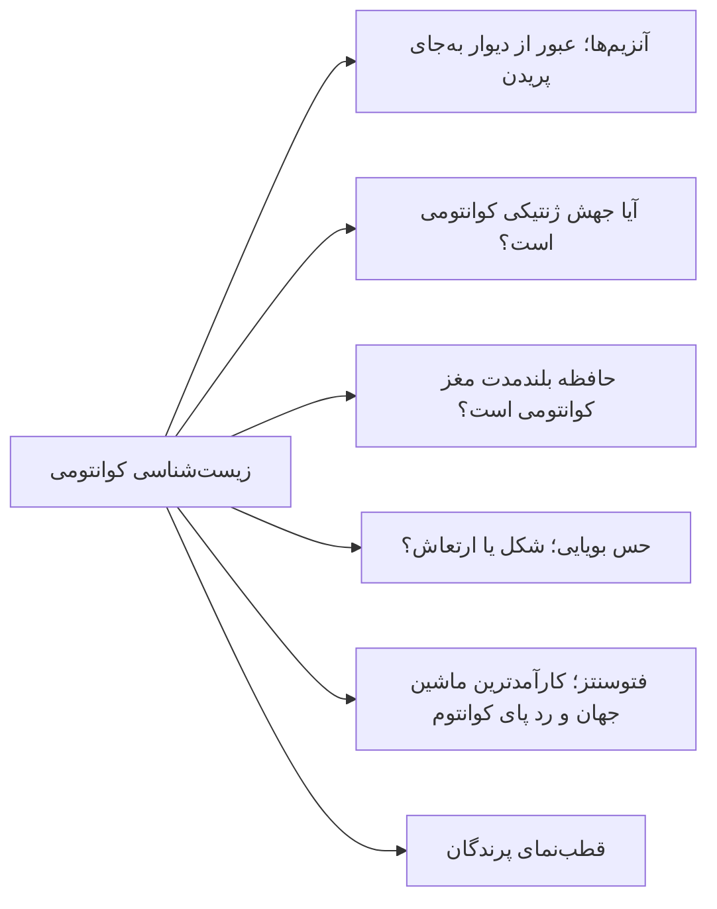

</details>

### 🔴 تفسیرها و فلسفهٔ کوانتوم (`interpretations`) — 11 مقالهٔ منتشرشده

```
تفسیرها و فلسفهٔ کوانتوم
 ├─ آیا فیزیک دانان بر سر معنای اندازه گیری توافق دارند؟  →  quantum-interpretation-debate
 ├─ آیا کوانتوم یعنی چندجهانی واقعی است؟  →  is-many-worlds-real
 ├─ اصل هولوگرافیک؛ آیا جهان ما یک هولوگرام است؟  →  holographic-principle
 ├─ تفسیر جهان‌های موازی  →  many-worlds-interpretation
 ├─ تفسیر دوبروی-بوهم چیست؟  →  pilot-wave
 ├─ تفسیر کپنهاگی  →  copenhagen-interpretation
 ├─ داروینیسم کوانتومی؛ چرا همه یک واقعیت می بینیم؟  →  quantum-darwinism
 ├─ نظریهٔ ریسمان و کوانتوم؛ جهان از جنس نت است؟  →  string-theory-quantum
 ├─ پارادوکس دوست ویگنر؛ آیا واقعیت برای همه یکی است؟  →  wigner-friend
 ├─ کوانتوم و ارادهٔ آزاد؛ آیا آینده از قبل نوشته شده؟  →  quantum-free-will
 └─ گرانش کوانتومی چیست؟ بزرگ ترین چالش فیزیک  →  quantum-gravity
```

- آیا فیزیک دانان بر سر معنای اندازه گیری توافق دارند؟ — `quantum-interpretation-debate`
- آیا کوانتوم یعنی چندجهانی واقعی است؟ — `is-many-worlds-real`
- اصل هولوگرافیک؛ آیا جهان ما یک هولوگرام است؟ — `holographic-principle`
- تفسیر جهان‌های موازی — `many-worlds-interpretation`
- تفسیر دوبروی-بوهم چیست؟ — `pilot-wave`
- تفسیر کپنهاگی — `copenhagen-interpretation`
- داروینیسم کوانتومی؛ چرا همه یک واقعیت می بینیم؟ — `quantum-darwinism`
- نظریهٔ ریسمان و کوانتوم؛ جهان از جنس نت است؟ — `string-theory-quantum`
- پارادوکس دوست ویگنر؛ آیا واقعیت برای همه یکی است؟ — `wigner-friend`
- کوانتوم و ارادهٔ آزاد؛ آیا آینده از قبل نوشته شده؟ — `quantum-free-will`
- گرانش کوانتومی چیست؟ بزرگ ترین چالش فیزیک — `quantum-gravity`

<details>
<summary>نمودار mermaid — تفسیرها و فلسفهٔ کوانتوم</summary>

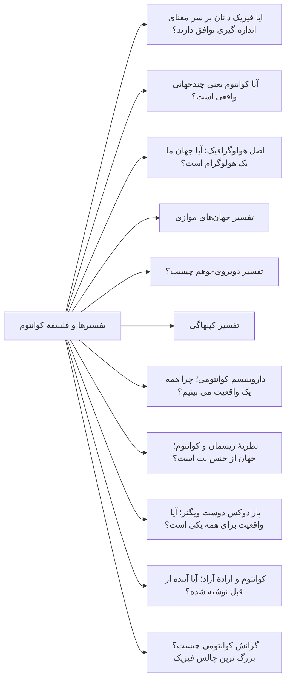

</details>

### ⬜ ریاضیات و فرمالیسم کوانتوم (`mathematics`) — 0 مقالهٔ منتشرشده

- *(خالی)*

### ⚫ نقد شبه‌علم (`pseudoscience`) — 16 مقالهٔ منتشرشده

```
نقد شبه‌علم
 ├─ «همه‌چیز انرژی است» — بررسی یک ادعا  →  everything-is-energy-claim
 ├─ آیا با فکر کردن می توان واقعیت کوانتومی را تغییر داد؟  →  mind-quantum-reality
 ├─ آیا جهان یک شبیه سازی است؟ نقد سه استدلال کوانتومی  →  simulation-hypothesis-quantum
 ├─ آیا درهم تنیدگی یعنی اطلاعات سریع تر از نور منتقل می شود؟  →  entanglement-myths
 ├─ آیا مغز انسان از پدیده های کوانتومی استفاده می کند؟ (بررسی ادعاها)  →  brain-quantum-phenomena
 ├─ آیا مغز کوانتومی است؟  →  is-the-brain-quantum
 ├─ آیا کوانتوم ثابت می کند خدا وجود دارد یا ندارد؟  →  does-quantum-prove-god
 ├─ ابررسانای دمای اتاق؛ درس LK-99 دربارهٔ هیجان علمی  →  room-temperature-superconductor
 ├─ انرژی نقطهٔ صفر و افسانهٔ انرژی رایگان  →  zero-point-energy-scam
 ├─ جاودانگی کوانتومی؛ کجای این استدلال می لنگد؟  →  quantum-immortality
 ├─ حباب هیجان کوانتومی؛ چقدرش واقعی است؟  →  quantum-hype-bubble
 ├─ شفای کوانتومی؛ چرا این ادعا شبه علم است؟  →  quantum-healing-debunked
 ├─ فیزیک کوانتوم در فیلم مرد مورچه ای؛ واقعیت یا تخیل؟  →  quantum-physics-in-movies-ant-man
 ├─ قانون جذب و کوانتوم؛ کجای این استدلال می لنگد؟  →  law-of-attraction-quantum
 ├─ چگونه ادعای شبه‌علمی را در یک جمله تشخیص دهیم  →  spot-pseudoscience-one-sentence
 └─ کوانتوم و پزشکی  →  quantum-alternative-medicine-science
```

- «همه‌چیز انرژی است» — بررسی یک ادعا — `everything-is-energy-claim`
- آیا با فکر کردن می توان واقعیت کوانتومی را تغییر داد؟ — `mind-quantum-reality`
- آیا جهان یک شبیه سازی است؟ نقد سه استدلال کوانتومی — `simulation-hypothesis-quantum`
- آیا درهم تنیدگی یعنی اطلاعات سریع تر از نور منتقل می شود؟ — `entanglement-myths`
- آیا مغز انسان از پدیده های کوانتومی استفاده می کند؟ (بررسی ادعاها) — `brain-quantum-phenomena`
- آیا مغز کوانتومی است؟ — `is-the-brain-quantum`
- آیا کوانتوم ثابت می کند خدا وجود دارد یا ندارد؟ — `does-quantum-prove-god`
- ابررسانای دمای اتاق؛ درس LK-99 دربارهٔ هیجان علمی — `room-temperature-superconductor`
- انرژی نقطهٔ صفر و افسانهٔ انرژی رایگان — `zero-point-energy-scam`
- جاودانگی کوانتومی؛ کجای این استدلال می لنگد؟ — `quantum-immortality`
- حباب هیجان کوانتومی؛ چقدرش واقعی است؟ — `quantum-hype-bubble`
- شفای کوانتومی؛ چرا این ادعا شبه علم است؟ — `quantum-healing-debunked`
- فیزیک کوانتوم در فیلم مرد مورچه ای؛ واقعیت یا تخیل؟ — `quantum-physics-in-movies-ant-man`
- قانون جذب و کوانتوم؛ کجای این استدلال می لنگد؟ — `law-of-attraction-quantum`
- چگونه ادعای شبه‌علمی را در یک جمله تشخیص دهیم — `spot-pseudoscience-one-sentence`
- کوانتوم و پزشکی — `quantum-alternative-medicine-science`

<details>
<summary>نمودار mermaid — نقد شبه‌علم</summary>

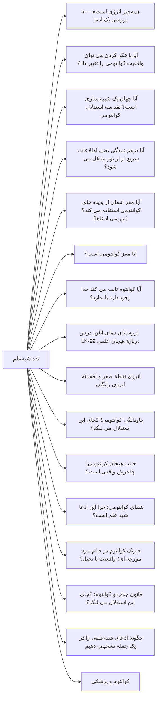

</details>

---

## پیش‌نویس‌ها (هنوز منتشر نشده)

### تاریخ و آزمایش‌های کوانتوم / آزمایش‌های کوانتومی (`experiments`) — 2

- آزمایش بل بدون حفره ۲۰۱۵ چه بود؟ — `loophole-free-bell-test`
- انتخاب تأخیری ویلر؛ فوتون از قبل تصمیم نگرفته — `wheeler-delayed-choice`

### تاریخ و آزمایش‌های کوانتوم / تاریخ کوانتوم (`history`) — 2

- نوبل فیزیک ۲۰۱۲؛ یک ذره را گرفتند و نکشتند — `nobel-physics-2012`
- نوبل فیزیک ۲۰۲۲؛ درهم تنیدگی دیگر فلسفه نیست — `nobel-physics-2022`

### تفسیرها و فلسفهٔ کوانتوم (`interpretations`) — 3

- تفسیر تراکنشی؛ دست دادن موج رفت و برگشت — `transactional-interpretation`
- فروپاشی عینی؛ گربه بدون ناظر می میرد — `objective-collapse`
- کیوبیسم؛ احتمال مال شماست نه مال جهان — `qbism`

### فناوری و کاربردهای کوانتومی / رایانش و ارتباطات کوانتومی (`quantum-computing`) — 5

- الگوریتم HHL؛ حل معادله با قید ریز چاپ — `hhl-algorithm`
- ریپیتر کوانتومی؛ چاپارخانهٔ درهم تنیدگی — `quantum-repeater`
- سه جور کیوبیت؛ ابررسانا، یون و فوتون — `qubit-types-compared`
- محاسبه با اندازه گیری؛ کامپیوتر یک طرفه — `measurement-based-quantum-computing`
- پروتکل BB84؛ قفل با فوتون نه با عدد سخت — `bb84-protocol`

### فناوری و کاربردهای کوانتومی / زیست‌شناسی کوانتومی (`quantum-biology`) — 2

- آنزیم های ترمیم DNA؛ جهش آخر خط نیست — `dna-repair-enzymes`
- تونل زنی در میتوکندری؛ الکترون یا پروتون؟ — `mitochondria-proton-tunneling`

### نقد شبه‌علم (`pseudoscience`) — 2

- هوش مصنوعی کوانتومی؛ بیشترش برچسب است — `quantum-ai-marketing-hype`
- کریستال درمانی؛ سنگ شفا نمی دهد — `crystal-healing-debunked`

### پدیده‌های کوانتومی (`phenomena`) — 3

- ابررسانایی توپولوژیک؛ زوج با گره در لبه — `topological-superconductivity`
- اثر آهارونوف-بوهم؛ فاز بدون میدان محلی — `aharonov-bohm-effect`
- شکاف لمب؛ دو تراز که نباید جدا می شدند — `lamb-shift`

---

## تالار دانشمندان (بدون دسته)

منتشرشده: **58** · پیش‌نویس: 4

```
کیوپدیا
 └─ تالار دانشمندان  /scientists/
    ├─ آرتور کامپتون؛ برخوردی که نور را ذره کرد  →  arthur-compton
    ├─ آرنولد زومرفلد؛ استادی که اتم بور را دقیق‌تر کرد  →  arnold-sommerfeld
    ├─ آلبرت اینشتین؛ نوبل برای نور، نه نسبیت  →  albert-einstein
    ├─ آلن اسپه؛ آزمایش‌های بل و بستن گریزگاه موضعیت  →  alain-aspect
    ├─ آنتون زایلینگر؛ تله‌پورت کوانتومی و آزمایش‌های درهم‌تنیدگی  →  anton-zeilinger
    ├─ آکیرا تونومورا؛ الکترون‌ها یکی‌یکی  →  akira-tonomura
    ├─ آیزاک نیوتن؛ مکانیکی که محدود بود نه غلط  →  isaac-newton
    ├─ اتو اشترن؛ آزمایشی که اسپین را عینی کرد  →  otto-stern
    ├─ ارنست رادرفورد؛ کاشف هستهٔ اتم  →  ernest-rutherford
    ├─ اروین شرودینگر؛ مردی که جهان را موج کرد  →  erwin-schrodinger
    ├─ امی نوتر؛ زنی که تقارن را ترجمه کرد  →  emmy-noether
    ├─ انریکو فرمی؛ معمار نخستین واکنش زنجیره‌ای هسته‌ای  →  enrico-fermi
    ├─ برایان جوزفسون؛ پیش‌بینی در ۲۲سالگی  →  brian-josephson
    ├─ جان بل؛ فیزیک‌دانی که درهم‌تنیدگی کوانتومی را آزمون‌پذیر کرد  →  john-bell
    ├─ جان فون‌نویمان؛ مغزی که کوانتوم را بنیان نوشت  →  john-von-neumann
    ├─ جان ویلر؛ مردی که سیاه‌چاله را نام گذاشت  →  john-wheeler
    ├─ جان کلارک؛ مداری که مثل اتم تونل زد  →  john-clarke
    ├─ جان کلاوزر؛ آزمایشگری که به حاشیه گوش نداد  →  john-clauser
    ├─ جرج گاموف؛ از تونل‌زنی تا مهبانگ  →  george-gamow
    ├─ جولیان شوینگر؛ مهارکنندهٔ بی‌نهایت‌ها  →  julian-schwinger
    ├─ جیمز کلرک ماکسول؛ مرد چهار معادله  →  james-clerk-maxwell
    ├─ دیوید بوهم؛ بازگشت متغیر پنهان  →  david-bohm
    ├─ دیوید دویچ؛ از تعریف فیزیکی محاسبه تا ماشین کوانتومی  →  david-deutsch
    ├─ دیوید هیلبرت؛ ریاضی‌دانی که زبان فیزیک کوانتومی را فراهم کرد  →  david-hilbert
    ├─ رابرت میلیکان؛ وزن کردن بار الکترون  →  robert-millikan
    ├─ ریچارد فاینمن؛ مردی که کوانتوم را به تصویر کشید  →  richard-feynman
    ├─ ساتیندرا بوز؛ نامه‌ای از داکا که مفهوم ذره را دگرگون کرد  →  satyendra-bose
    ├─ سرژ آروش؛ فوتونی در قفس که نمرد  →  serge-haroche
    ├─ سین-ایتیرو توموناگا؛ نابغهٔ تنها در جنگ  →  sin-itiro-tomonaga
    ├─ فریمن دایسون؛ پلی که سه زبان الکترودینامیک کوانتومی را یکی کرد  →  freeman-dyson
    ├─ لئو اساکی؛ دیودی که از دیوار عبور کرد  →  leo-esaki
    ├─ لو لاندائو؛ نابغه‌ای که سانحه خاموشش کرد  →  lev-landau
    ├─ لودویگ بولتزمن؛ شمارندهٔ بی‌نظمی  →  ludwig-boltzmann
    ├─ لویی دوبروی؛ شاهزاده‌ای که الکترون را موج کرد  →  louis-de-broglie
    ├─ لیزه مایتنر؛ مادر شکافت هسته‌ای  →  lise-meitner
    ├─ ماری کوری؛ دو نوبل، یک زندگی  →  marie-curie
    ├─ ماکس بورن؛ مترجم احتمال در کوانتوم  →  max-born
    ├─ ماکس پلانک؛ انقلابی محافظه‌کار در قلب فیزیک  →  max-planck
    ├─ میشل دووره؛ مدار را اتم مصنوعی کرد  →  michel-devoret
    ├─ نیلز بور؛ معماری که زبان دنیای اتمی را ساخت  →  niels-bohr
    ├─ هانس بته؛ مردی که راز خورشید را گشود  →  hans-bethe
    ├─ هانس کرامرس؛ نابغهٔ گمنام مکانیک کوانتومی  →  hendrik-kramers
    ├─ هاینریش روهرر؛ دیدن اتم‌ها با لمس  →  heinrich-rohrer
    ├─ هرمان وایل؛ ریاضی‌دانی که تقارن را زبان فیزیک کرد  →  hermann-weyl
    ├─ هیدکی یوکاوا؛ فیزیک‌دانی که ذره‌ای نادیده را برای پیوند هسته اتم پیش‌بینی کرد  →  hideki-yukawa
    ├─ هیو اورت؛ فیزیک‌دانی که با حذف فروریزش، جهان‌های چندگانه را پیش نهاد  →  hugh-everett
    ├─ والتر گرلاخ؛ دستانی که اسپین را دیدند  →  walther-gerlach
    ├─ ورنر هایزنبرگ؛ جوانی که عدم قطعیت را کشف کرد  →  werner-heisenberg
    ├─ ولفگانگ پاولی؛ ذهنی تیز که به طبیعت نظم داد  →  wolfgang-pauli
    ├─ وویچیخ زورک؛ توضیح‌دهندهٔ دنیای کلاسیک  →  wojciech-zurek
    ├─ پاسکوال یوردان؛ ریاضی‌دانی که در سایه ماند اما پایه‌ها را ساخت  →  pascual-jordan
    ├─ پل اهرنفست؛ پلی که زیر پای خودش شکست  →  paul-ehrenfest
    ├─ پل دیراک؛ سکوت، ریاضیات و پیش‌بینی پادماده  →  paul-dirac
    ├─ پیتر شور؛ الگوریتمی که امنیت رمزنگاری کلاسیک را از بنیان به پرسش کشید  →  peter-shor
    ├─ چارلز ویلسون؛ رد ذرات روی ابر  →  charles-wilson
    ├─ کلینتون دیویسون؛ کشف تصادفی موج الکترون  →  clinton-davisson
    ├─ گرد بینیگ؛ نخستین نگاه به اتم‌ها  →  gerd-binnig
    └─ یوجین ویگنر؛ زبان تقارن در فیزیک  →  eugene-wigner
```
